Nama    : Fatriya Ibnu Ash shidiqqi  
Kelas   : TI - 3B  
NIM     : 2241720138  

## Pertemuan 4
### Praktikum 1: Eksperimen Tipe Data List
Selesaikan langkah-langkah praktikum berikut ini menggunakan VS Code atau Code Editor favorit Anda.  
#### Langkah 1:
Ketik atau salin kode program berikut ke dalam void main() 
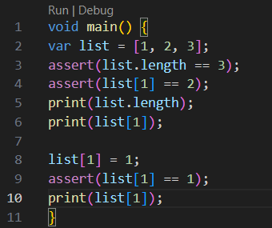  
#### Langkah 2:
Silakan coba eksekusi (Run) kode pada langkah 1 tersebut. Apa yang terjadi? Jelaskan!  
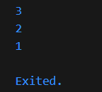  
#### Langkah 3:
Ubah kode pada langkah 1 menjadi variabel final yang mempunyai index = 5 dengan default value = null. Isilah nama dan NIM Anda pada elemen index ke-1 dan ke-2. Lalu print dan capture hasilnya.
Apa yang terjadi ? Jika terjadi error, silakan perbaiki.
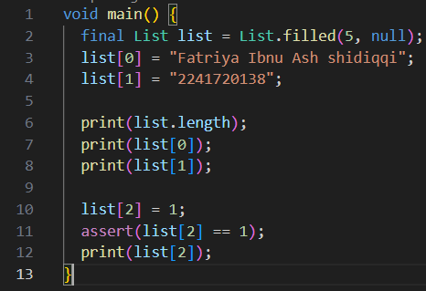  
Hasil  
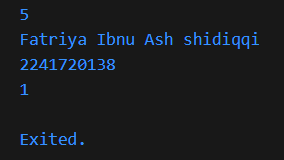  

### Praktikum 2: Eksperimen Tipe Data Set
Selesaikan langkah-langkah praktikum berikut ini menggunakan VS Code atau Code Editor favorit Anda.
#### Langkah 1:
Ketik atau salin kode program berikut ke dalam fungsi main().
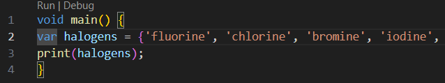  
#### Langkah 2:
Silakan coba eksekusi (Run) kode pada langkah 1 tersebut. Apa yang terjadi? Jelaskan! Lalu perbaiki jika terjadi error.
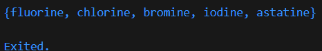  
#### Langkah 3:
Tambahkan kode program berikut, lalu coba eksekusi (Run) kode Anda.
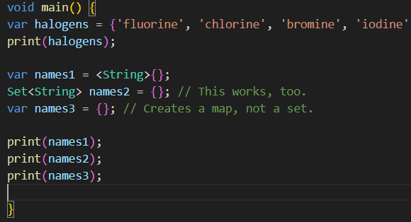  
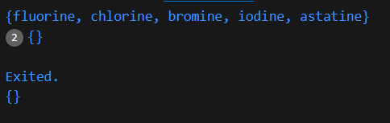  

### Praktikum 3: Eksperimen Tipe Data Maps
Selesaikan langkah-langkah praktikum berikut ini menggunakan VS Code atau Code Editor favorit Anda.
### Langkah 1:
Ketik atau salin kode program berikut ke dalam fungsi main().
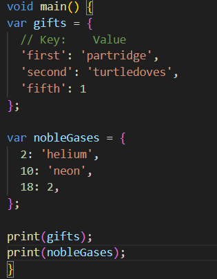  
### Langkah 2:
Silakan coba eksekusi (Run) kode pada langkah 1 tersebut. Apa yang terjadi? Jelaskan! Lalu perbaiki jika terjadi error.
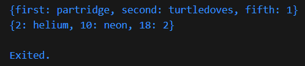  
### Langkah 3:
Tambahkan kode program berikut, lalu coba eksekusi (Run) kode Anda.
  
Apa yang terjadi ? Jika terjadi error, silakan perbaiki.
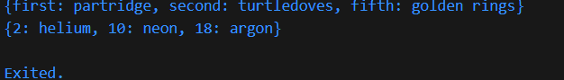  
tidak terjadi error  
Tambahkan elemen nama dan NIM Anda pada tiap variabel di atas (gifts, nobleGases, mhs1, dan mhs2). Dokumentasikan hasilnya dan buat laporannya!
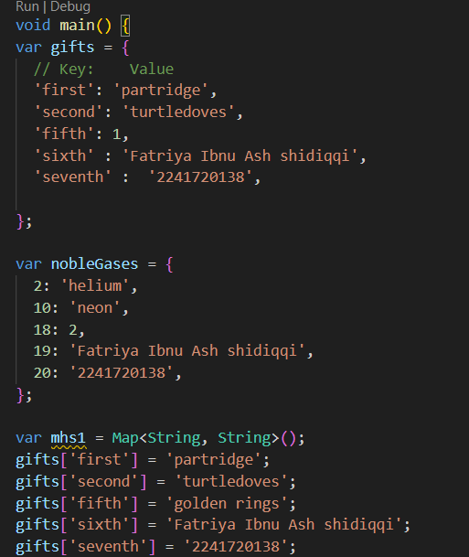  
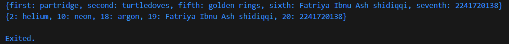  

## Praktikum 4: Eksperimen Tipe Data List: Spread dan Control-flow Operators
### Langkah 1:
Ketik atau salin kode program berikut ke dalam fungsi main().
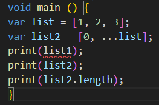  
Silakan coba eksekusi (Run) kode pada langkah 1 tersebut. Apa yang terjadi? Jelaskan! Lalu perbaiki jika terjadi error.
  
terjadi error karena tidak ada variabel list1 yang terdefinisi, seharusnya variabel list1 diganti list  
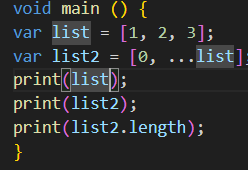  
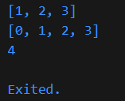  
### Langkah 3:
Tambahkan kode program berikut, lalu coba eksekusi (Run) kode Anda.
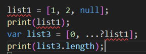  
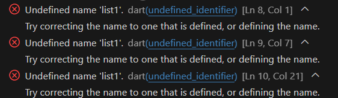  
Apa yang terjadi ? Jika terjadi error, silakan perbaiki.  
Terjadi error karena variabel list1 belum terdefinisi. Seharusnya ditambahkan kode var list1 agar variabel list1 bisa terdefinisi  
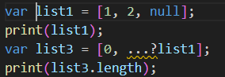  
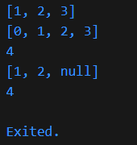  

### Langkah 4:
Tambahkan kode program berikut, lalu coba eksekusi (Run) kode Anda.
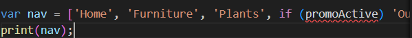  
Apa yang terjadi ? Jika terjadi error, silakan perbaiki. Tunjukkan hasilnya jika variabel promoActive ketika true dan false.  
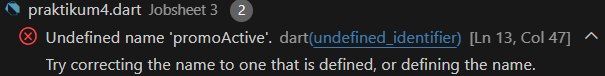  
Variabel promoActive belum terdefinisi dan tidak ada nilainya sehingga terjadi error  
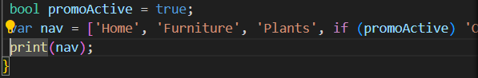  
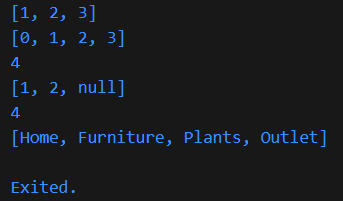  
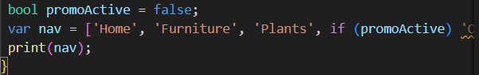  
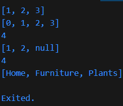  

### Langkah 5:
Tambahkan kode program berikut, lalu coba eksekusi (Run) kode Anda.
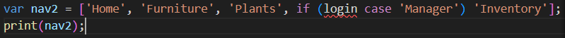  
Apa yang terjadi ? Jika terjadi error, silakan perbaiki. Tunjukkan hasilnya jika variabel login mempunyai kondisi lain. 
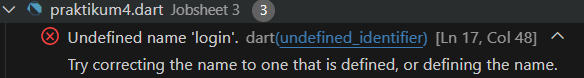  
Terjadi error karena  variabel login belum terdefinisi dan tidak memiliki nilai  
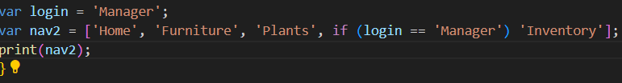  
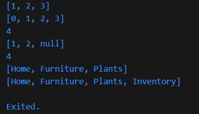  
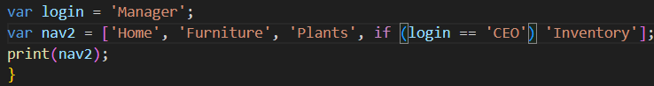  
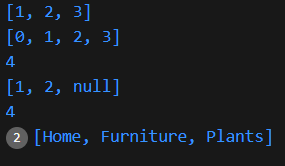  

### Langkah 6:
Tambahkan kode program berikut, lalu coba eksekusi (Run) kode Anda.
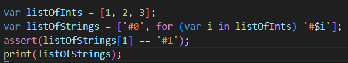  
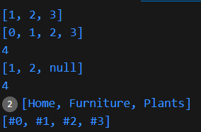  
Apa yang terjadi ? Jika terjadi error, silakan perbaiki. Jelaskan manfaat Collection For dan dokumentasikan hasilnya.  
Tidak terjadi error  
Manfaat Collection For adalah

##  Praktikum 5: Eksperimen Tipe Data Records
### Langkah 1:
Ketik atau salin kode program berikut ke dalam fungsi main().
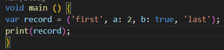  
### Langkah 2:
Silakan coba eksekusi (Run) kode pada langkah 1 tersebut. Apa yang terjadi? Jelaskan! Lalu perbaiki jika terjadi error.
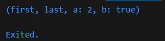  
### Langkah 3:
Tambahkan kode program berikut di luar scope void main(), lalu coba eksekusi (Run) kode Anda.
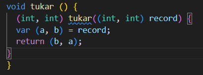 
Apa yang terjadi ? Jika terjadi error, silakan perbaiki. Gunakan fungsi tukar() di dalam main() sehingga tampak jelas proses pertukaran value field di dalam Records.
