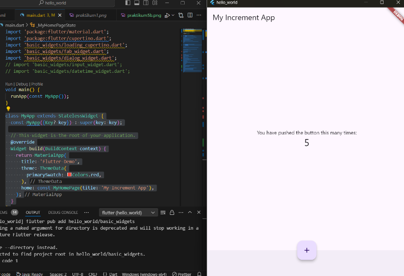

Nama  : Fatriya Ibnu Ash shidiqqi  
Kelas : TI 3B  
NIM   : 2241720138   

# Aplikasi Pertama dan Widget Dasar Flutter
### Praktikum 1: Membuat Project Flutter Baru

 

###  Praktikum 2: Menghubungkan Perangkat Android atau Emulator

### Praktikum 3 : Membuat Repository GitHub dan Laporan Praktikum

 

### Praktikum 4: Menerapkan Widget Dasar
#### Text Widget

#### Image widget

### Praktikum 5 : 
#### Scafold Widget

#### Dialog Widget

